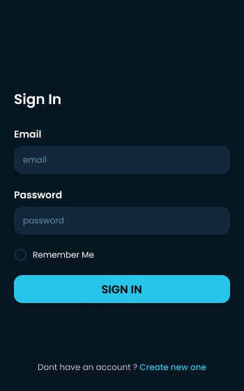
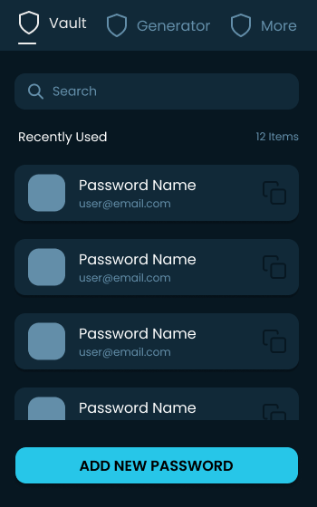
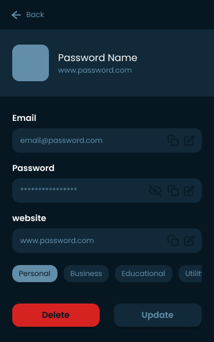
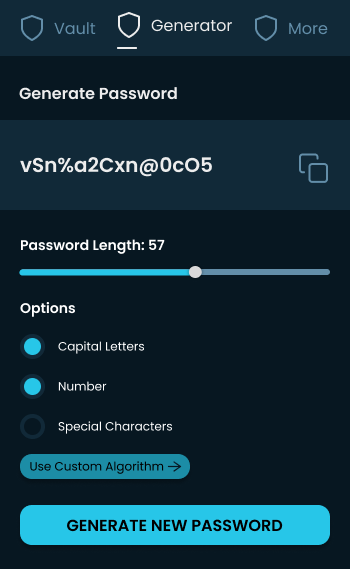
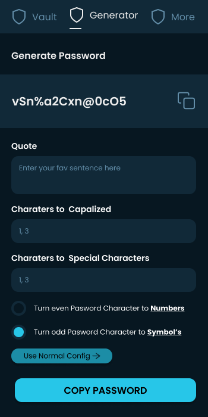

# Password Manager

Custom Browser extension that lets your manage your passwords and it can also generate password with custom algoriths that is easy to remember.

## Run Locally

[**Setup Backend 🔗**](https://github.com/itsdevdeepak/my-med-identity-backend)
 

## Screenshots

    
    
    
    
    

